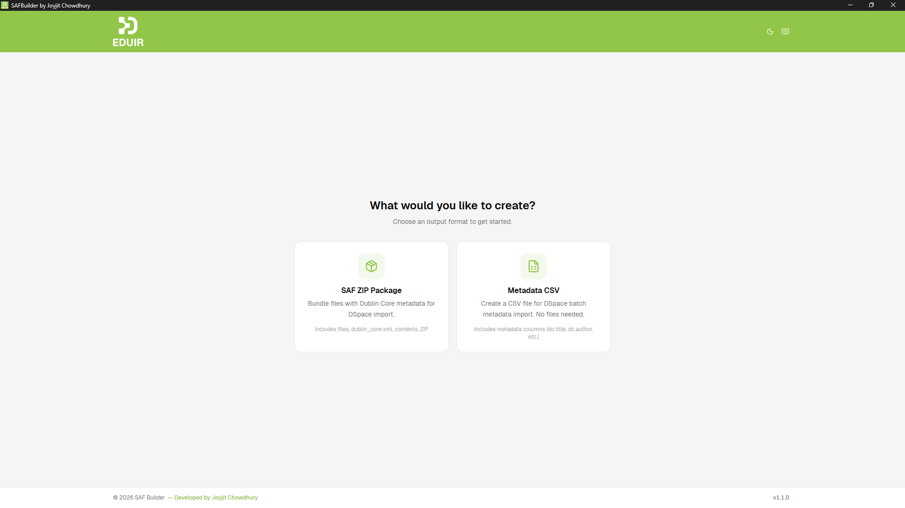
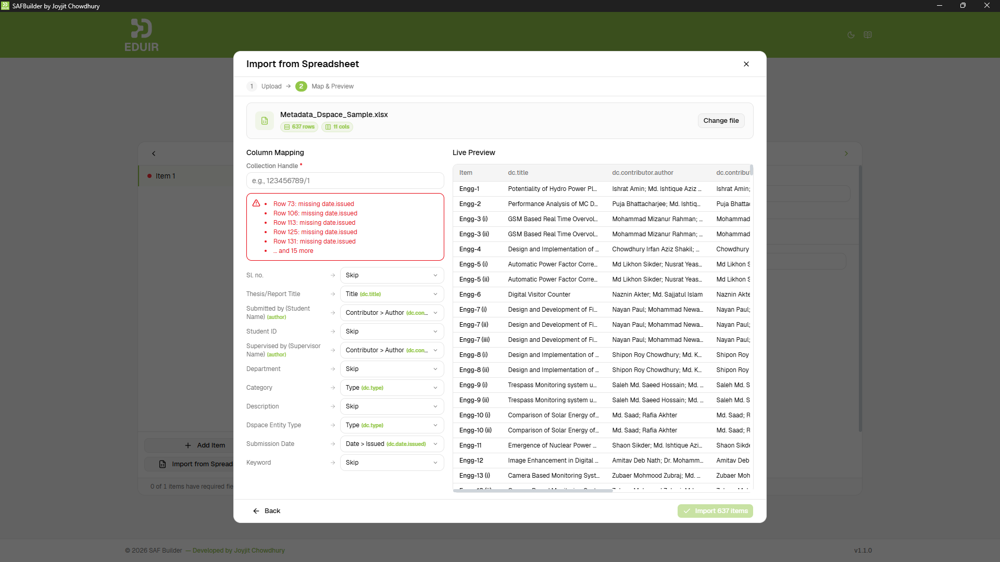
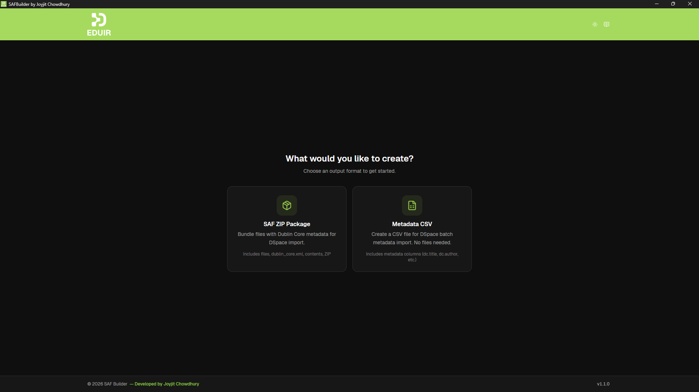
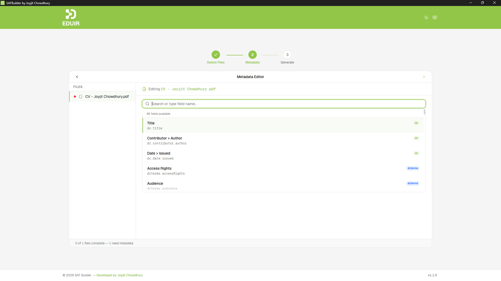
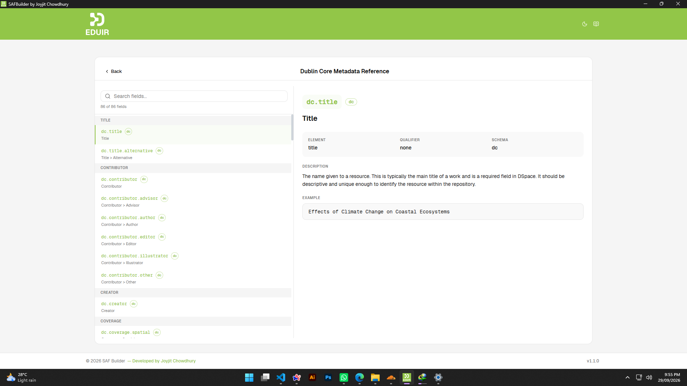
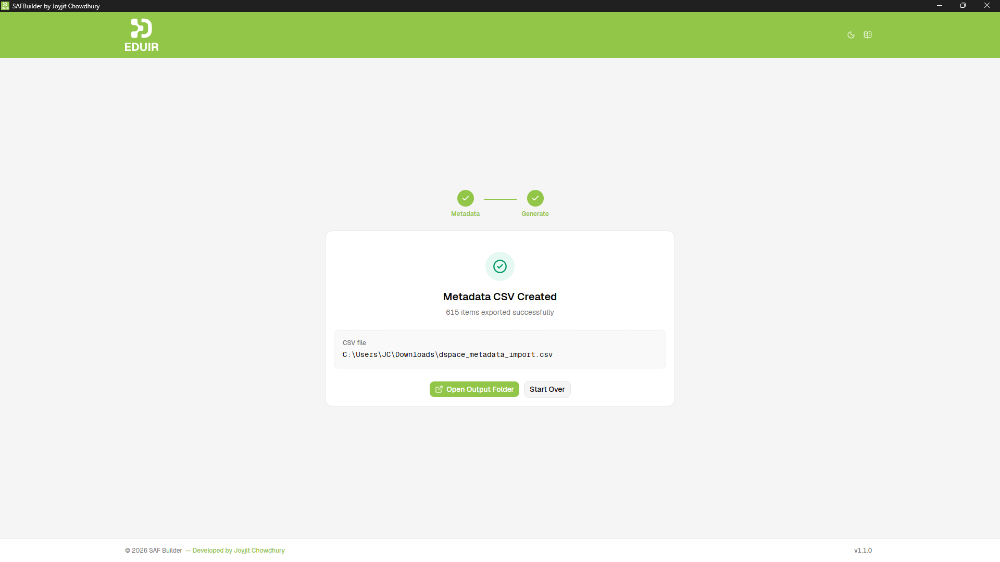

# SAFBuilder

*by Joyjit Chowdhury*

A modern desktop application for creating DSpace Simple Archive Format (SAF) packages. Select your files (or import from a spreadsheet), add Dublin Core metadata, and generate either a ZIP package ready for batch import into DSpace institutional repositories or a metadata-only CSV file for DSpace's batch metadata import workflow.

Built with Tauri 2.0, React 19, and Tailwind CSS 4.



## Features

### Dual Output Modes
- **SAF ZIP Package** — Bundle files with Dublin Core metadata (`dublin_core.xml`, `contents`, bitstreams) into a single ZIP ready for DSpace's Administrative > Import interface
- **Metadata CSV** — Export metadata-only `dspace_metadata_import.csv` (no bitstreams) for DSpace's batch metadata update workflow. Add items one-by-one or import many at once from a spreadsheet.

### File Selection & Spreadsheet Import
- **File Selection** — Pick multiple bitstreams via native OS dialog with per-type icons (PDF, DOC/DOCX, PNG/JPG/GIF, MP4, TXT, CSV) and color coding
- **Duplicate Detection** — Prevents the same file from being added twice (toast notification)
- **Spreadsheet Importer** — Upload a CSV/TSV/XLSX/XLS with item metadata. Auto-maps columns to DC fields (`title`, `author`, `date`, `category`, etc.) using header heuristics. Live preview shows the first 100 mapped items before import. Accepts comma- or tab-delimited files (delimiter auto-detected).
- **Add/Remove Items** (CSV mode) — `+ Add Item` button adds empty rows, per-row `X` removes items



### Dublin Core Metadata
- **86 Predefined Fields** — 68 DC + 12 DCTERMS + 5 thesis (legacy) + 1 DSpace entity type, each with full description and example
- **Searchable Picker** — Type-ahead filters by header, label, or description; supports keyboard navigation (Arrow/Enter/Esc); priority fields (title/author/date) surface first
- **Custom Fields** — Type any `dc.element.qualifier` or custom schema field (e.g., `local.note`); suggestion appears if no exact match
- **Specialized Inputs** —
  - `dc.date.*` fields use a calendar `DatePicker` (with Today/Clear)
  - `dc.type` uses a dropdown of 29 DCMI Type Vocabulary values
  - `dspace.entity.type` uses a dropdown of 10 DSpace entity types
- **Multi-Value Support** — Add multiple values per field (e.g., multiple authors separated by `,` or `;`)
- **Copy Metadata** — Copy metadata from one file to another via the `Copy from` dropdown (SAF mode)
- **Status Indicators** — Red/yellow/green dot per file:
  - Red — no metadata yet
  - Yellow — some metadata but missing one or more required fields (`dc.title` + `dc.contributor.*` + `dc.date.*`)
  - Green — all required fields set

### Output
- **ZIP Output** — Generates `saf_package.zip` with structured `item_NNN/` directories
- **CSV Output** — Generates `dspace_metadata_import.csv` (DSpace format: `+`, `id`, `collection` columns; field columns sorted with required fields first; values separated by `||`; formula-injection escaped with `'` prefix)
- **Open Output Folder** — Reveal the generated file in the OS file manager (via `plugin-opener`)
- **Progress Bar** — Visual feedback during generation (capped at 90% while awaiting backend; jumps to 100% on completion)
- **Error Reporting** — Per-file errors surfaced on the success screen; generation failures shown inline (no jarring alerts)

### UX & Polish
- **Dublin Core Reference** — Built-in documentation browser: searchable list grouped by element, detail panel with full description and example for each of the 85 fields (DC + DCTERMS + thesis)
- **Dark Mode** — Light + Dark + System theme via `ThemeProvider` + header toggle (persisted in `localStorage` as `saf-builder-theme`)
- **Toast Notifications** — Auto-dismiss after 3 s, manual dismiss via X
- **Error Boundary** — Catches render errors with a "Reload App" fallback
- **Animations** — Framer Motion (`motion/react`) for screen transitions, list staggers, progress reveals, modal fade-in
- **Accessibility** — Modal dialogs have `role="dialog"` + `aria-modal` + Escape to close; file picker has full keyboard nav; field search uses ARIA `combobox`/`listbox`/`option` semantics; all interactive elements have descriptive `aria-label`s
- **Automatic Updates** — Checks GitHub Releases on launch for a newer version; the footer version number is the update control — click it to check for updates, and a pulsing dot appears beside it whenever a newer version is available (even after dismissing the dialog). The dialog shows release notes, live download progress, and a one-click restart. Updates are Ed25519-signed and verified before install.



## Tech Stack

| Layer | Technology |
|-------|-----------|
| Desktop Framework | Tauri 2.0 (Rust) |
| Frontend | React 19 + TypeScript |
| UI Components | shadcn/ui (button, input, card, badge, alert, progress, calendar, popover, select) |
| Animations | Framer Motion (`motion/react`) |
| Icons | Lucide React |
| Styling | Tailwind CSS 4 |
| Font | Geist (Sans + Mono, 6 woff2) |
| Theme | Light / Dark / System via `ThemeProvider` + header toggle (persisted in `localStorage`) |
| Build Tool | Vite 8 (Rolldown bundler) with code splitting (react-vendor, motion, tauri chunks) |
| Tauri Plugins | `plugin-dialog` (file picker), `plugin-opener` (open folder), `plugin-updater` (signed auto-updates), `plugin-process` (restart after update) |
| XML Generation | quick-xml 0.42 |
| ZIP Creation | zip 8 (Deflate) |
| Spreadsheet Parsing | xlsx 0.18.5 (lazy-loaded inside CSV-mode chunks only) |
| Date Utilities | date-fns 4 (`format`, `parseISO`) + `react-day-picker` |
| Installer | NSIS (setup.exe) + WiX (MSI) with custom `header.bmp` / `sidebar.bmp` branding, `downloadBootstrapper` WebView2 |
| Window | 1200×800 (min 900×600), centered, resizable, maximized on launch |

## Security

- **Minimal capability surface** — only `core:default`, `dialog:default`/`allow-open`, and `opener:default`/`allow-open-path` are granted. No `shell`, `fs`, `http`, or `process` permissions
- **Strict CSP** — `script-src 'self'`; no inline scripts; `connect-src ipc: http://ipc.localhost` only (no telemetry, no analytics)
- **Path-traversal protection** — backend validates filenames (`/`/`\`/`..` rejected), headers (alphanumeric + `_`/`-`), and project paths before any I/O
- **XML injection-safe** — uses `quick_xml::Writer` event API with proper attribute/text escaping; no string concatenation
- **CSV formula-injection escaped** — cells starting with `=`, `+`, `-`, `@`, `\t`, `\r` get a `'` prefix (OWASP recommendation)
- **No shell execution** — verified: zero `Command::new`, `system(`, `exec(`, `eval`, `dangerouslySetInnerHTML` calls in the codebase
- **Input validation** — all user inputs validated at the IPC boundary with typed structs (no string-typed command dispatch)
- **Signed updates** — update bundles are Ed25519-signed in CI; the app verifies the signature against a pinned public key before installing, so a compromised release channel cannot inject code

## Prerequisites

- **Node.js** 20.19+ or 22.12+ (Vite 8 requirement)
- **Rust** 1.88 or later (install via [rustup](https://rustup.rs/)) — required by zip 8
- **Microsoft C++ Build Tools** — "Desktop development with C++" workload (Windows)
- **WebView2 Runtime** — Pre-installed on Windows 10 (1803+) and Windows 11; otherwise downloaded at install time via `downloadBootstrapper`

## System Requirements

| Platform | Minimum | Recommended |
|----------|---------|-------------|
| **Windows** | Windows 10 (1803+) / Windows 11, 4 GB RAM, 200 MB disk | Windows 11, 8 GB RAM |
| **macOS** | macOS 10.15 (Catalina) or later, 4 GB RAM, 200 MB disk | macOS 13 (Ventura) or later |

### Additional Requirements

- **Windows**: WebView2 Runtime (pre-installed on Windows 10 1803+ and Windows 11; otherwise downloaded automatically at install time)
- **macOS**: None — WebKit is bundled with macOS

## Installation

### From Installer

Download the installer for your platform from the
[GitHub Releases](https://github.com/jcasdeveloper/dspace-saf-builder/releases) page:

| Platform | Files |
|----------|-------|
| Windows | `*_x64-setup.exe` (NSIS) or `*_x64_en-US.msi` (WiX) |
| macOS | `*_aarch64.dmg` (Apple Silicon) or `*_x64.dmg` (Intel), unsigned: right-click → Open on first launch |

Local builds also produce installers under:

```
src-tauri/target/release/bundle/
├── nsis/
│   └── SAFBuilder by Joyjit Chowdhury_<version>_x64-setup.exe   (Windows, branded NSIS)
└── msi/
    └── SAFBuilder by Joyjit Chowdhury_<version>_x64_en-US.msi   (Windows, WiX)
```

### From Source

```bash
git clone https://github.com/jcasdeveloper/dspace-saf-builder.git
cd dspace-saf-builder
npm install
npm run tauri dev
```

## Build

```bash
npm run tauri build
```

To produce updater artifacts (`.sig` files), the build must run with the signing key in the environment:

```powershell
$env:TAURI_SIGNING_PRIVATE_KEY = "<path to private key or its contents>"
npm run tauri build
```

This produces platform-specific installers:

| Platform | Output |
|----------|--------|
| Windows | `.exe` (NSIS) + `.msi` |
| macOS | `.dmg` + `.app` (min macOS 10.15) |

## Updates

The app checks GitHub Releases for new versions — silently on launch, or on demand by clicking the version number in the footer. To ship an update:

1. Bump the version in `package.json`, `package-lock.json`, `src-tauri/tauri.conf.json`, `src-tauri/Cargo.toml`, and `src-tauri/Cargo.lock`
2. Commit, tag `vX.Y.Z`, and push the tag
3. The **Release** workflow builds signed installers and creates a draft release containing `latest.json` and `.sig` signature files
4. Publish the release — installed apps detect it on next launch and install in-app

> **Keep the signing key safe.** The private key lives outside the repo (`~/.tauri/`) and is provided to CI as the `TAURI_SIGNING_PRIVATE_KEY` secret. If it is lost, already-installed apps can never verify future updates.

## Usage

### Step 0: Choose Output Mode

On first launch, pick **SAF ZIP Package** (bundle files + metadata into a ZIP for DSpace import) or **Metadata CSV** (generate a CSV for DSpace's batch metadata update workflow — no bitstreams). The chosen mode determines which step flow you see.

---

### SAF ZIP Flow

#### Step 1: Select Files

Click **Select Files** to open the native file picker. Choose one or more bitstream files (PDFs, images, documents, etc.). Files appear in a list with type icons and status indicators. Use **Add more** / **Clear** / per-file **X** to manage the list.

#### Step 2: Add Metadata

For each file, search and add Dublin Core fields using the searchable dropdown. The picker includes all 85 fields (67 DC + 1 DSpace entity + 12 DCTERMS + 5 thesis) — type-ahead filters by header, label, or description, supports keyboard navigation (Arrow/Enter/Esc), and allows custom field names. You can also type any dotted field name for custom schemas.

- **Red dot** — No metadata yet
- **Yellow dot** — Has some metadata but is missing one or more required fields (`dc.title`, `dc.contributor.*`, `dc.date.*`)
- **Green dot** — All required fields set (`dc.title` + `dc.contributor.*` + `dc.date.*`)

Use **Copy from** to copy metadata between files with shared fields (same author, date, etc.).



##### Specialized Field Inputs

- **`dc.date.*`** — Calendar picker with Today/Clear shortcuts. Stored as ISO `YYYY-MM-DD`. Free-text fallback for partial dates (`YYYY`, `YYYY-MM`) which are normalized to ISO.
- **`dc.type`** — Dropdown of 29 DCMI Type Vocabulary values (Animation, Article, Book, Thesis, etc.).
- **`dspace.entity.type`** — Dropdown of 10 DSpace entity types (Publication, Person, OrgUnit, Project, etc.).

#### Dublin Core Reference

Click **Dublin Core Docs** in the header to open the reference browser. Left panel: searchable list of all 85 fields grouped by element (Title, Contributor, Coverage, etc.). Click a field to see its details on the right: header code, schema badge (`dc` / `dcterms` / `dspace` / `thesis`), element/qualifier/label, full description, and example value. Both panels scroll independently within a fixed-height container.



#### Step 3: Generate ZIP

Select an output folder and click **Create ZIP Package**. A progress bar is shown during generation. The app generates a `saf_package.zip` containing properly structured SAF items:

```
saf_package.zip
├── item_000/
│   ├── dublin_core.xml
│   ├── contents
│   └── paper.pdf
├── item_001/
│   ├── dublin_core.xml
│   ├── metadata_thesis.xml
│   ├── contents
│   └── thesis.pdf
└── ...
```

On success: shows item count, output path, ZIP path, and any per-file errors, with **Open Output Folder** (opener plugin) and **Start Over**. Import the ZIP directly into DSpace via the Administrative > Import interface.

---

### Metadata CSV Flow

#### Step 1: Add Items

The CSV mode starts with one empty item. Use:

- **+ Add Item** to add new empty rows
- **Import from Spreadsheet** to batch-import many items at once
- Per-item `X` to remove individual rows

Each item shows its filename (`Item 1`, `Item 2`, … by default; renamed to spreadsheet filename on import) and a colored status dot.

#### Spreadsheet Importer (bulk import)

Click **Import from Spreadsheet** to open the importer modal:

1. **Upload** — Drop or pick a `.csv`, `.tsv`, `.xlsx`, or `.xls` file. The file is parsed client-side; tab/comma delimiter is auto-detected for CSV/TSV.
2. **Map & Preview** — Each spreadsheet column is auto-mapped to a DC field using header heuristics (`title`/`thesis`/`report` → `dc.title`; `author`/`submitted by`/`supervisor` → `dc.contributor.author`; `date`/`submission` → `dc.date.issued`; etc.). Override any column's mapping via the searchable dropdown. Required: provide a **Collection Handle** (e.g., `123456789/1`).
3. **Import** — The first 100 mapped items are shown in a live preview; click **Import N items** to commit.

If the file has rows with mismatched column counts, an amber warning appears at the top of the mapping step.

#### Step 2: Add Metadata per Item

Same as the SAF ZIP flow — each item uses the same searchable field picker with the same specialized inputs (Date Picker for `dc.date.*`, type dropdowns for `dc.type` and `dspace.entity.type`). All items must have at least one required field set (`dc.title` + `dc.contributor.*` + `dc.date.*`) before continuing.

#### Step 3: Generate CSV

Select an output folder and click **Generate CSV**. The app generates a `dspace_metadata_import.csv` with:

- Header row: `id`, `collection`, then all field columns (required fields first, then alphabetical)
- Each item row: `+` (insert marker), collection handle, then each field's values joined with `||`
- Formula-injection escape: cells starting with `=`, `+`, `-`, `@`, `\t`, `\r` get a `'` prefix

On success: shows item count and CSV path, with **Open Output Folder** and **Start Over**. Import the CSV into DSpace via the Administrative > Batch Metadata Import interface.



---

## Project Structure

```
saf-builder/
├── src/                                  # React frontend
│   ├── main.tsx                          # React entry point: mounts App, imports globals.css
│   ├── App.tsx                           # Main app: 8-step flow with step machine (welcome → SAF or CSV → done → docs)
│   ├── types.ts                          # TypeScript interfaces (MetadataEntry, FileMetadata, GenerateResult, AppStep, OutputMode, MappingConfig)
│   ├── data/
│   │   ├── dc-fields.ts                  # 85 field definitions (67 DC + 12 DCTERMS + 1 DSpace + 5 thesis) with descriptions & examples
│   │   ├── dc-type-values.ts             # 29 DCMI Type Vocabulary values for dc.type dropdown
│   │   └── entity-type-values.ts         # 10 DSpace entity types for dspace.entity.type dropdown
│   ├── lib/
│   │   ├── animations.ts                 # Framer Motion variants (fadeIn, scaleIn, slideUp, stepPop, screenSlide, stagger)
│   │   ├── csv-generator.ts              # DSpace CSV format generation + hasRequiredFields validation + formula-injection escape
│   │   ├── spreadsheet-parser.ts         # CSV/TSV (delimiter sniffing) + XLSX/XLS parser, autoMapColumn heuristics, applyMapping
│   │   └── useFieldChange.ts             # Shared hook for metadata field editing logic
│   ├── utils/
│   │   └── fileIcons.ts                  # File type icon paths + color coding (PDF, DOC, PNG, etc.)
│   ├── styles/
│   │   └── globals.css                   # Tailwind theme tokens (light + dark), 6 Geist @font-face, scrollbar
│   └── components/
│       ├── Header.tsx                    # App header: siteicon.svg logo (w-16) + theme toggle + Dublin Core Docs button
│       ├── Footer.tsx                    # Credits + interactive version (update check, pulsing badge when update pending)
│       ├── ModeSelector.tsx              # Welcome screen: choose SAF ZIP or Metadata CSV mode
│       ├── StepIndicator.tsx             # 3-step (SAF) or 2-step (CSV) progress indicator
│       ├── FilePicker.tsx                # SAF Step 1: file selection + empty state + duplicate detection
│       ├── FileList.tsx                  # SAF left panel: file list with status + Copy from dropdown
│       ├── MetadataEditor.tsx            # SAF Step 2: split layout (FileList | FieldEditor)
│       ├── FieldEditor.tsx               # Right panel: field editing for selected file
│       ├── FieldSearchBar.tsx            # Searchable DC field picker (Arrow/Enter/Esc nav, ARIA combobox)
│       ├── FieldRow.tsx                  # Single field with multi-value inputs (Input / DatePicker / Select by field type)
│       ├── DatePicker.tsx                # Calendar picker for dc.date.* fields (Today/Clear)
│       ├── CsvMetadataEditor.tsx         # CSV Step 1: split layout + + Add Item + Import from Spreadsheet
│       ├── SpreadsheetImporter.tsx       # Modal: upload → auto-map columns → live preview → import (with collection handle)
│       ├── ProgressPanel.tsx             # SAF Step 3: output selection + ZIP generation
│       ├── CsvProgressPanel.tsx          # CSV Step 2: output selection + CSV generation
│       ├── Documentation.tsx             # DC reference: two-panel search/detail browser
│       ├── Toast.tsx                     # Auto-dismiss (3 s) notification with manual X
│       ├── UpdateDialog.tsx              # Update modal: release notes, download progress, install + restart
│       ├── ErrorBoundary.tsx             # React error boundary wrapping the screen
│       ├── SearchableSelect.tsx          # Custom searchable dropdown used in spreadsheet column mapping
│       ├── theme-provider.tsx            # Light/dark/system theme context + localStorage persistence
│       └── ui/                           # shadcn/ui primitives (alert, badge, button, card, calendar, input, popover, progress, select)
├── src-tauri/                            # Rust backend
│   ├── src/lib.rs                        # Two #[tauri::command] entry points: generate_saf + generate_metadata_csv; 21 unit tests
│   ├── src/main.rs                       # Tauri entry
│   ├── build.rs                          # tauri_build
│   ├── Cargo.toml                        # Rust deps: tauri, plugins, anyhow, serde, quick-xml, zip
│   ├── tauri.conf.json                   # App config: window (maximized 1200×800), icons, NSIS branding, downloadBootstrapper
│   ├── capabilities/
│   │   └── default.json                  # Permissions: core, dialog, opener (no shell/fs/http/process)
│   ├── icons/                            # App icons (32, 128, @2x, .ico, .icns, Store logos, iOS variants)
│   └── windows/
│       ├── header.bmp                    # 150×57 installer header (green #92c648)
│       ├── sidebar.bmp                   # 164×314 installer sidebar
│       ├── wix-banner.bmp                # WiX MSI banner
│       └── wix-dialog.bmp                # WiX MSI dialog image
├── public/
│   ├── icon.png                          # App icon + favicon (source for `tauri icon`)
│   ├── siteicon.svg                      # Header branding (SAFBuilder mark)
│   └── fonts/                            # Geist Sans/Mono woff2 (6 files)
├── package.json                          # Node deps (xlsx, motion, react 19, tailwindcss 4, vite 8, tauri 2)
├── vite.config.ts                        # Vite 8 + Rolldown + @tailwindcss/vite, port 1420, code-split groups
└── README.md
```

## Development

### Recommended IDE

[VS Code](https://code.visualstudio.com/) with:
- [Tauri Extension](https://marketplace.visualstudio.com/items?itemname=tauri-apps.tauri-vscode)
- [rust-analyzer](https://marketplace.visualstudio.com/items?itemname=rust-lang.rust-analyzer)

### Commands

```bash
npm run tauri dev      # Start development server (Vite on 1420)
npm run tauri build    # Build production installers
npm run build          # Build frontend only (Vite)
```

### Testing

```bash
cargo test --lib                                # Run 21 Rust unit tests (validators + field parsing)
cargo clippy --all-targets --locked -- -D warnings   # Lint (must pass clean)
```

> **Note:** Frontend test suite (Vitest) is not yet scaffolded. The most regression-critical paths — `parseCsv`, `escapeCsvField`, `autoMapColumn`, `hasRequiredFields` — are currently covered only by manual smoke tests.

### Window Configuration

Default window: 1200×800 (min 900×600), centered, resizable, **maximized on launch**. See `src-tauri/tauri.conf.json`.

## License

Released under the [MIT License](LICENSE).

Copyright (c) 2026 Joyjit Chowdhury.
